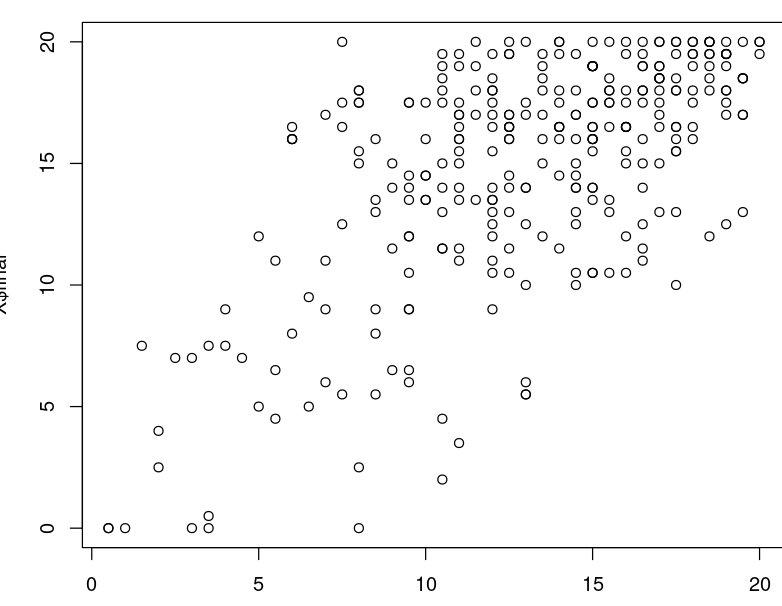
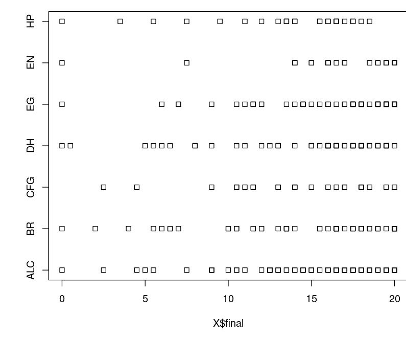

# TP1 SY02 : Prise en main de R

## 3 Structures de données usuelles

On utilise les vecteurs pour des variables quantitatives.  
2. Initialiser le vecteur colonne notes.  
```R
notes <- c(18, 1.5, 9.5, 15.5, 15, 15.5, 0.5, 14.5, 10)
```
3. Ajoute la valeur 4.  
```R
notes <- c(notes, 4)
```
4. La variable notes10 devient donc le vecteur notes avec toutes les valeurs divisées par 2.  
```R
 > notes10 <- notes / 2
[1] 9.00 0.75 4.75 7.75 7.50 7.75 0.25 7.25 5.00 2.00  
```
On renvoie toutes les notes supérieurs à 10.
```R
 > notes10 > 6  
TRUE FALSE FALSE  TRUE  TRUE  TRUE FALSE  TRUE FALSE FALSE
```
Il y a donc 5 étudiants qui ont eu plus de 6/10.

5. Moyenne de 3 valeurs (Il faut les mettres dans un $c(..,..,..)$ car moyenne prend un seul argument qui est un vecteur)
```R 
(v[1] + v[5] + v[3]) / 3  
mean(c(v[1], v[5], v[3]))
```
6. Filtrage on cherche combien de notes sont supérieurs à 10.
```R
choix <- notes > 10  
length(notes[choix])
```

7. 
```R
min(notes[(notes - floor(notes)) == 0])
```
notes - floor(notes) renvoie la partie décimal du nombre.
Si elle est == à 0, le nombre est non fractionnaire. Il reste juste a appliquer un filtrage comme  avec choix.

8. Met dans notes2 le vecteur notes avec toutes les valeurs diminuées par 2
```R
notes2 <- notes - 2 
```

9. 
```R
# Renvoie le nombre de valeurs inférieurs à 0
length (notes2 [notes2 < 0])

# Met à 0 toutes les notes inférieurs à 0
notes2[notes2 < 0] <- 0
```

On utilise des facteurs pour les variables qualitatives.

```R
> collection <- c("R", "V", "B", "V")
> collection
[1] "R" "V" "B" "V"
> f <- factor( c("R", "V", "B", "V"))
> f
[1] R V B V
Levels: B R V # Correspond aux modalitées (valeurs prises dans l'echantillon)

(f <- ordered(collection))
[1] R V B V
Levels: B < R < V
f > "B"
[1] TRUE TRUE FALSE TRUE
f <- factor(collection, ordered = TRUE)
f < "R"
[1] FALSE FALSE TRUE FALSE
(f <- factor(collection, ordered = TRUE, levels = c("R", "V", "B")))
[1] R V B V
Levels: R < V < B
f < "R"
[1] FALSE FALSE FALSE FALSE
```

10. 
```R
ADN <- factor(c("A","C","A","A","G","A","T","G","C","C","A","T","T","G","T","C"))
ADN
# [1] A C A A G A T G C C A T T G T C
# Levels: A C G T
nlevels(ADN)
# [1] 4
levels(ADN)
# [1] "A" "C" "G" "T"
```

11. 
```R
# Nombre de A dans le brin d'ADN
length(ADN[ADN == "A"])
# [1] 5
length(ADN[ADN == "T"])
# [1] 4
length(ADN[ADN == "C"])
# [1] 4
length(ADN[ADN == "G"])
# [1] 3
```

12. 
```R
length(X) # Nb de colonnes de X 
ncol(X) # Nb de colonnes de X
nrow(X) # Nb de lignes de X
names(X) # Nom des colonnes de X
# [1] "correcteur.median" "median"            "correcteur.final"  "final"             "moyenne"           "resultat"

```
Pas vraiment de différence entre length et ncol (length est utilisé pour donner la taille d'un vecteur alors que ncol est utilisé pour un data frame.)

13. 
Il y a 3 variables qualitatives et 3 quantitatives sur chaque ligne.

14. 
```R
X[1,1] # Extrait le 1er élément
X[,3] # Extrait la 3e colonne
X[1:10,] # Extrait les 10 premières lignes
X[c(1,3),c(1,4)] # Extraire les lignes 1 et 3 et les colonnes 1 et 4

X[,c(2,6)] # Extrait la 2e et la dernière colonne du tableau X
```

15. 
```R
mean(X[X$correcteur.median == "EG",2]) # Moyenne des étudiants du médian ayant été corrigé par EG
# [1] 12.63208
```
16. 
```R
nrow(X[X$median < X$final,]) / nrow(X) # Proportion d'étudiants qui ont eu une meilleure note au final qu'au médian. 
```

17. 
```R
mean(X$final) # Moyenne
sd(X$final) # écart-type
var(X$final) # Variance
median(X$final) # Médiane
max(X$final) 
min(X$final)
```

18. 
```R
> head(X)
```
|   | correcteur.median | median | correcteur.final | final | moyenne | resultat |
|--:|------------------:|-------:|-----------------:|------:|--------:|---------:|
| 1 |                BR |   11.0 |              ALC |  17.5 |    14.9 |        C |
| 2 |                EN |   14.0 |               BR |  16.0 |    15.2 |        C |
| 3 |               ALC |   10.5 |              ALC |  13.0 |    12.0 |        D |
| 4 |                BR |   17.0 |               BR |  13.0 |    14.6 |        C |
| 5 |                EG |   14.5 |               EN |  14.0 |    14.2 |        C |
| 6 |                EG |   12.0 |               EN |  19.5 |    16.5 |        B |
```R
summary(X$final)
```
| correcteur.median |     median    | correcteur.final |     final     |    moyenne    |   resultat       |
|------------------:|--------------:|-----------------:|--------------:|--------------:|-----------------:|
| Length:297        | Min.   : 0.50 | Length:297       | Min.   : 0.00 | Min.   : 0.20 | Length:297       |  
| Class :character  | 1st Qu.:10.50 | Class :character | 1st Qu.:12.50 | 1st Qu.:12.30 | Class :character |  
| Mode  :character  | Median :13.50 | Mode  :character | Median :16.00 | Median :14.90 | Mode  :character |  
|                   | Mean   :12.96 |                  | Mean   :14.76 | Mean   :14.04 |                  |  
|                   | 3rd Qu.:16.50 |                  | 3rd Qu.:18.00 | 3rd Qu.:17.00 |                  |  
|                   | Max.   :20.00 |                  | Max.   :20.00 | Max.   :20.00 |                  |

19. Quartiles
```R
IQR(X$median) # Etendue inter-quartile (Q3-Q1)
quantile(X$median)
```
|0%  | 25%  | 50%  | 75%  | 100%  |
|---:|-----:|-----:|-----:|------:|
|0.5 | 10.5 | 13.5 | 16.5 |  20.0 | 

20. Moyenne tronquée d'ordre 10
```R
mean(sort(X$median)[11:287]) # Moyenne tronquée d'ordre 10 (moyenne en enlevant les 10 premières et les 1à dernières valeurs)
```

21. Diagramme en bande
```R
barplot(table(X$correcteur.median))  # Diagramme en bande
# Nb de copies corrigé par correcteur.
# On remrque que ALC a corrigé le plus de copies
```
.png)

22. Boite à moustache des notes de final
```R
boxplot(X$final)
```
.png)

23. 
Il y a 6 valeurs abérantes car on a 6 points sous le dernier trait
24. Diagramme en tige et feuille de la moyenne
```R
stem(X$moyenne)
```
```
   0 | 224
   1 | 247
   2 | 3
   3 | 22
   4 | 79
   5 | 0124469
   6 | 01134579
   7 | 02457
   8 | 22355888
   9 | 2224
  10 | 1255
  11 | 000111223345899
  12 | 0000001112233335555566667777788999
  13 | 00022234455666667777
  14 | 00000111223333344455666666778889999
  15 | 000001222333444455566666666677889999
  16 | 00011122333333455556667777788999
  17 | 000011122333444444456667888999
  18 | 00000011122223444566788899999
  19 | 00011223333444678
  20 | 00
```

25. Histogramme des notes du final
```R
hist(X$final)
```
.png)

26. Coupe l'histogramme à 15
```R
hist(X$final, breaks = c(0,15,20))
```

27. Renvoie les valeurs de densité présentes sur l'histogramme. (Valeur en ordonnée)
```R
histo$density # Renvoie les valeurs de densité présentes sur l'histogramme.
```

28.
```R
sum (diff(histo$breaks) * histo$density)
histo$breaks # Renvoie les abscices ou il y a un break
diff(histo$breaks) # Renvoie donc la longueur de chaque rectangle
diff(c(1,5,9,2)) # diff renvoie v[i] = v[i+1] - v[i]
```

29. 
```R
plot(X$median , X$final)
```

On remarque que les valeurs sont dans la diagonale. Les notes du médian et du final sont donc un peu près égales pour tout les étudiants : Un étudiant qui réussi le final réussi aussi le médian et inversement.

30. Boite à moustache en fonction des correcteurs
```R
boxplot(X$final ~ X$correcteur.final) # Boite à moustache en fonction des correcteurs
```
.png)

31. Boite à moustache du correcteur DH
```R
 boxplot(X$final[X$correcteur.final == "DH"] ~ X$correcteur.final[X$correcteur.final == "DH"])
```
.png)


32. Graph avec les carrés
```R
stripchart(X$final ~ X$correcteur.final, data = X)
 ```
 

33. $method = "jitter"$ permet de décaler les carrés pour mieux voir le nombre de points présents
```R
stripchart(X$final ~ X$correcteur.final, data = X, method = "jitter")
```
 .png)